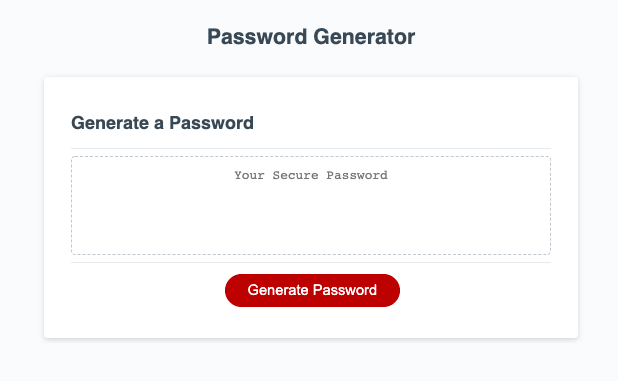

# Password Generator

This web application allows you to generate a random password 8 to 128 characters long using a combination of letters, numbers, and special characters.

## User Interface

## Usage
When run you select a password length between 8 and 128 characters.

Then you select the character types to include from the following catagories
- Numbers
- Uppercase letters
- Lowercase letters
- special characters

[List of Password Special Characters from the OWASP Foundation](https://owasp.org/www-community/password-special-characters)

## Links to website and Github
[Password Generator](https://bagl0025.github.io/PasswordGenerator/)

<a href="https://github.com/bagl0025/PasswordGenerator.git" target="_blank">Github Repository</a>

## Author
Brian Bagley

March 2022
